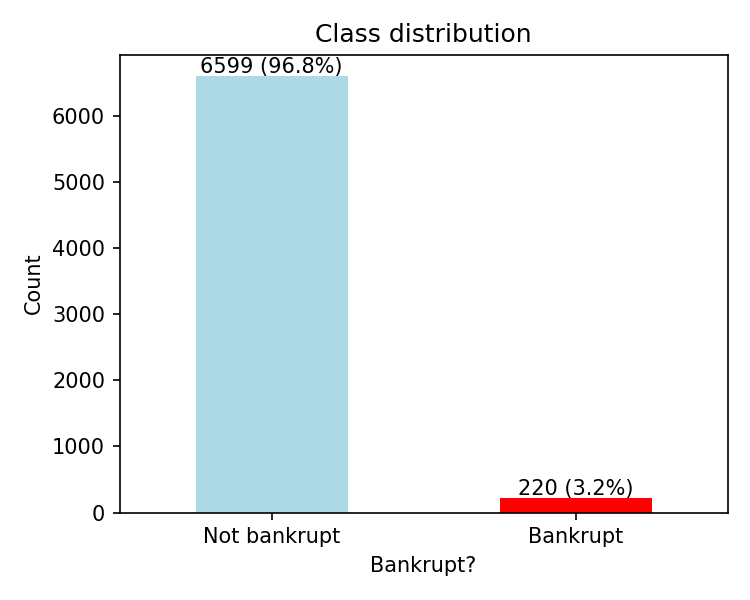
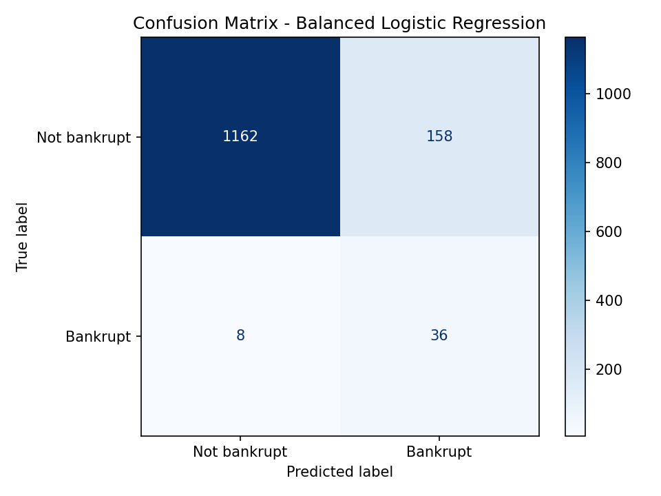
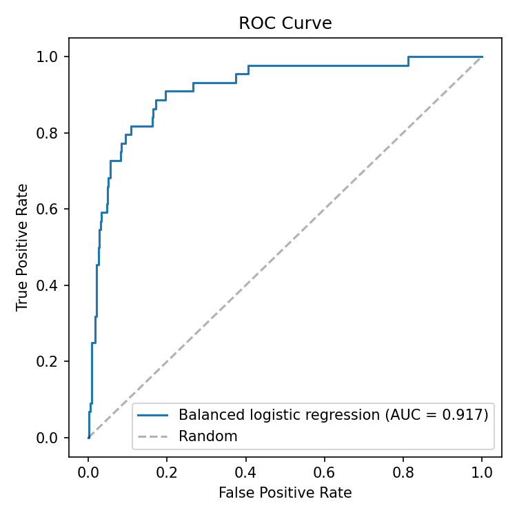

# Bankruptcy Prediction with Logistic Regression

A simple supervised binary classification task in Python: predicting whether a company goes bankrupt from its financial ratios.

## Goal

Train a logistic regression model on company-level financial ratios and evaluate how well it separates bankrupt from non-bankrupt firms. Logistic regression is used as a standard baseline for binary classification.

## Data

The data is **not included** in this repository. It is the Taiwanese Bankruptcy Prediction dataset, which contains financial ratios for Taiwanese companies from 1999 to 2009, collected from the Taiwan Economic Journal. Each company is one row, and the target column `Bankrupt?` is 1 if the company went bankrupt and 0 otherwise. The classes are heavily imbalanced, with far fewer bankrupt than healthy companies.

- Kaggle: search for "Company Bankruptcy Prediction" (fedesoriano)
- UCI Machine Learning Repository: "Taiwanese Bankruptcy Prediction"
- Original study: Liang, D., Lu, C.-C., Tsai, C.-F., & Shih, G.-A. (2016). Financial ratios and corporate governance indicators in bankruptcy prediction: A comprehensive study. *European Journal of Operational Research, 252*(2), 561-572.

Download the CSV and save it as `data.csv` in the project folder.

## Method

1. Load the data, remove constant columns, and check class balance, outliers, and correlated features
2. Split into training (80%) and test (20%) sets, keeping the bankruptcy rate the same in both
3. Standardize the features, fitting the scaler on the training data only
4. Fit a logistic regression with balanced class weights, since only about 3% of companies are bankrupt
5. Evaluate on the test set with accuracy, ROC AUC, a classification report, and a confusion matrix
6. Compare against an unweighted model and run 5-fold cross-validation as a robustness check

## Results

Running the script saves the plots as PNG files in the project folder.





## Project structure

```
.
├── bankruptcy_logistic_regression.py
├── data.csv               # download separately (not tracked)
├── *.png                  # plots created by the script
├── requirements.txt
└── README.md
```

## How to run

```bash
pip install -r requirements.txt
python bankruptcy_logistic_regression.py
```

## Limitations

- The data covers a single market and a single decade, so the results may not generalize elsewhere.
- Each company appears as one cross-sectional snapshot, not as a time series leading up to bankruptcy.
- There are no macroeconomic variables, so firm-specific and economy-driven bankruptcies are mixed together.
- Only logistic regression is used, with and without class weights. Comparing it with other classifiers such as random forests or gradient boosting would show whether a linear decision boundary limits performance.

## Libraries

pandas, NumPy, scikit-learn, matplotlib, seaborn